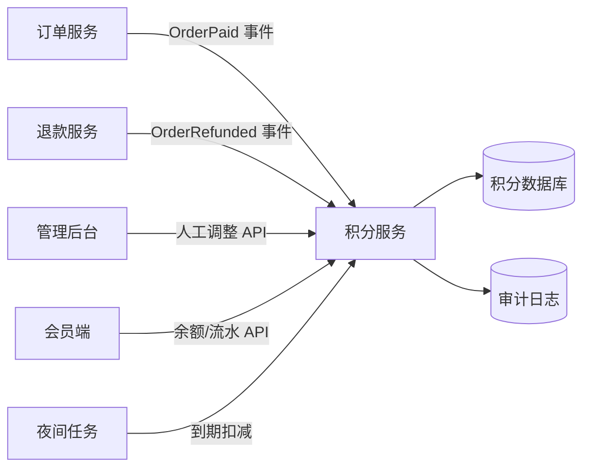

# 会员积分技术方案

## 1. 背景与目标

基于会员积分 PRD，本方案覆盖会员在订单支付成功后获得积分、查看当前可用积分与完整积分流水、管理员手动调整积分、退款冲正积分、积分到期扣减，以及防止同一订单重复发放积分。

核心目标：

- 支付成功订单按 `1 USD = 1 point` 发放积分，且同一订单只发放一次。
- 积分流水创建后不可变，所有余额变化都通过新增流水体现。
- 会员端可查询可用余额与历史流水。
- 管理端可在有权限且填写原因后进行人工调整，并保留审计信息。
- 夜间任务扣减到期积分并写入到期流水。
- 退款按退款金额冲正对应积分。

## 2. 需求理解与联合评审结论

### 2.1 前端关注点

- 会员端需要展示当前可用积分、积分流水列表、流水类型、变动值、来源、时间、到期时间或说明。
- 管理端调整积分时必须有明确权限校验反馈，原因字段必填，并在提交前展示调整方向与数量。
- 流水不可变，因此页面不提供编辑或删除流水的入口。
- 对重复提交、网络重试、异步订单事件延迟等情况，前端只展示最终状态，不承担幂等判断。

### 2.2 后端关注点

- 积分余额必须由服务端统一计算或维护，不能信任前端传入的余额。
- 订单支付、退款、过期、人工调整都应统一落到积分流水表。
- 防重复发放需要在数据层建立唯一约束，不能只依赖应用层判断。
- 管理员调整必须写入操作人、原因、请求来源与审计字段。
- 到期扣减任务需要可重试、可分页、可观测，避免单次任务失败导致整批中断。

### 2.3 待确认假设

- 积分按订单实付 USD 金额向下取整为整数积分；若系统已有金额最小单位，则以 cents 计算后再换算。
- PRD 提到“campaign defines a shorter expiry”，本方案预留 `campaign_id` 与 `expires_at`，但活动规则来源由营销/活动系统提供。
- 退款冲正积分按退款金额对应的积分数量执行，不允许把同一订单冲正到低于该订单已发放积分的负数。
- 当前 PRD 未要求积分消费，本方案仅覆盖获得、冲正、调整、过期和查询。

## 3. 总体架构

积分能力由 `Points Service` 承接，向订单、退款、后台管理和会员端提供统一接口。



建议采用事件驱动结合幂等 API：

- 订单支付成功后发布 `OrderPaid` 事件，积分服务消费并发放积分。
- 退款成功后发布 `OrderRefunded` 事件，积分服务消费并冲正积分。
- 管理后台通过同步 API 提交人工调整。
- 到期扣减由定时任务扫描并批量写入到期流水。

## 4. 数据模型

### 4.1 member_points_account

会员积分账户表，用于快速读取当前可用余额。

| 字段 | 类型 | 说明 |
| --- | --- | --- |
| id | bigint | 主键 |
| member_id | bigint | 会员 ID，唯一 |
| available_points | integer | 当前可用积分，不小于 0 |
| lifetime_earned_points | integer | 历史累计获得积分，可选 |
| created_at | datetime | 创建时间 |
| updated_at | datetime | 更新时间 |
| version | integer | 乐观锁版本 |

约束：

- `unique(member_id)`
- `available_points >= 0`

### 4.2 points_ledger

积分流水表。流水创建后不可修改业务字段；如需修正，通过新增反向流水完成。

| 字段 | 类型 | 说明 |
| --- | --- | --- |
| id | bigint | 主键 |
| member_id | bigint | 会员 ID |
| account_id | bigint | 积分账户 ID |
| type | enum | `ORDER_AWARD` / `REFUND_REVERSAL` / `ADMIN_ADJUSTMENT` / `EXPIRY` |
| points_delta | integer | 积分变动，正数增加，负数扣减 |
| balance_after | integer | 创建该流水后的账户余额 |
| source_type | enum | `ORDER` / `REFUND` / `ADMIN` / `EXPIRY_JOB` |
| source_id | string | 来源业务 ID |
| order_id | string | 订单 ID，可空 |
| refund_id | string | 退款 ID，可空 |
| campaign_id | string | 活动 ID，可空 |
| expires_at | datetime | 本次获得积分的到期时间，扣减类流水可空 |
| reason | string | 人工调整或系统扣减原因 |
| created_by | string | 操作人，系统任务使用固定值 |
| created_at | datetime | 创建时间 |
| idempotency_key | string | 幂等键 |

关键索引：

- `unique(idempotency_key)`
- `unique(order_id, type)` where `type = ORDER_AWARD`
- `index(member_id, created_at desc)`
- `index(member_id, expires_at)` for unexpired award entries
- `index(source_type, source_id)`

### 4.3 points_adjustment_audit

管理员人工调整审计表，保留更完整的管理后台上下文。

| 字段 | 类型 | 说明 |
| --- | --- | --- |
| id | bigint | 主键 |
| ledger_id | bigint | 对应流水 ID |
| admin_id | bigint | 管理员 ID |
| member_id | bigint | 被调整会员 ID |
| points_delta | integer | 调整积分 |
| reason | string | 必填原因 |
| request_id | string | 请求追踪 ID |
| ip_address | string | 操作 IP |
| user_agent | string | 客户端信息 |
| created_at | datetime | 创建时间 |

## 5. 核心流程设计

### 5.1 订单支付发放积分

1. 订单服务在订单支付成功后发送 `OrderPaid` 事件。
2. 积分服务根据订单实付 USD 金额计算积分：`floor(paid_amount_usd)`。
3. 若积分为 0，不写入发放流水，可记录业务日志。
4. 生成幂等键：`order_award:{order_id}`。
5. 在事务中创建账户或锁定账户，插入 `ORDER_AWARD` 流水，更新账户余额。
6. 数据库唯一约束保证同一订单无法重复发放。

并发与重试：

- 消息重复投递时，命中 `idempotency_key` 唯一约束后返回已处理状态。
- 若应用层先查后写发生竞态，以数据库唯一约束为最终保护。

### 5.2 退款冲正积分

1. 退款服务发送 `OrderRefunded` 事件，包含 `refund_id`、`order_id`、退款金额。
2. 积分服务查询该订单已发放积分和已冲正积分。
3. 根据退款金额计算本次应冲正积分。
4. 冲正数量不得超过该订单剩余可冲正积分。
5. 使用幂等键：`refund_reversal:{refund_id}`。
6. 在事务中插入 `REFUND_REVERSAL` 负向流水并更新账户余额。

余额不足处理：

- 若会员当前积分不足以完全扣减，按产品策略需确认是否允许余额为 0 后保留欠扣记录。
- 本方案默认不允许负余额；冲正扣减上限为当前可用余额，差额记录在业务日志或待处理表中，供运营追踪。
- 若业务要求订单积分必须完整回收，应补充“积分负余额”或“冻结待扣”规则。

### 5.3 管理员人工调整

1. 管理后台检查管理员是否具备积分调整权限。
2. 前端要求填写会员、调整积分、调整原因；原因不可为空。
3. 后端再次校验权限、原因、积分范围和会员状态。
4. 使用请求级幂等键，防止页面重复提交。
5. 在事务中插入 `ADMIN_ADJUSTMENT` 流水、更新账户余额、写入审计表。

校验规则：

- `points_delta != 0`
- 扣减后余额不能小于 0，除非后续确认允许负积分。
- `reason` 建议限制为 10 到 500 字符，便于审计有效性。
- 管理端不允许修改已有流水。

### 5.4 积分到期扣减

1. 夜间任务扫描已到期且未被完全扣减的积分获得流水。
2. 按会员聚合本次到期积分，计算可扣减数量。
3. 在事务中写入 `EXPIRY` 负向流水并更新余额。
4. 到期流水来源使用 `source_type = EXPIRY_JOB`，`source_id` 为任务批次 ID 或到期日期。

实现建议：

- 到期判断使用 `expires_at <= job_cutoff_time`。
- 任务按会员或流水 ID 分页处理，避免长事务。
- 每批处理记录成功数、失败数、耗时和最后游标。
- 到期任务幂等键建议为 `expiry:{member_id}:{expiry_date}` 或更细粒度的 `expiry:{ledger_id}:{date}`。

### 5.5 会员余额与流水查询

会员端读取：

- `GET /members/me/points/balance`
- `GET /members/me/points/ledger?page_size=&cursor=&type=`

展示字段：

- 当前可用积分。
- 流水类型：订单获得、退款扣减、人工调整、积分过期。
- 积分变动值，正数和负数视觉区分。
- 创建时间、来源说明、到期时间、管理员调整原因的会员可见摘要。

分页建议：

- 使用游标分页，按 `created_at desc, id desc` 排序。
- 默认每页 20 条，最大 100 条。

## 6. API 设计

### 6.1 查询积分余额

`GET /api/v1/members/me/points/balance`

响应：

```json
{
  "member_id": "12345",
  "available_points": 1280,
  "updated_at": "2026-04-24T10:30:00Z"
}
```

### 6.2 查询积分流水

`GET /api/v1/members/me/points/ledger?page_size=20&cursor=...&type=ORDER_AWARD`

响应：

```json
{
  "items": [
    {
      "id": "90001",
      "type": "ORDER_AWARD",
      "points_delta": 120,
      "balance_after": 1280,
      "source_type": "ORDER",
      "source_id": "order_001",
      "description": "Order reward",
      "expires_at": "2027-04-24T00:00:00Z",
      "created_at": "2026-04-24T10:30:00Z"
    }
  ],
  "next_cursor": "..."
}
```

### 6.3 管理员调整积分

`POST /api/v1/admin/members/{member_id}/points/adjustments`

请求：

```json
{
  "points_delta": 50,
  "reason": "Customer service compensation",
  "idempotency_key": "admin-adjustment-uuid"
}
```

响应：

```json
{
  "ledger_id": "91001",
  "member_id": "12345",
  "points_delta": 50,
  "balance_after": 1330,
  "created_at": "2026-04-24T10:45:00Z"
}
```

错误码建议：

| HTTP 状态 | code | 场景 |
| --- | --- | --- |
| 400 | `INVALID_POINTS_DELTA` | 调整积分为 0 或格式错误 |
| 400 | `REASON_REQUIRED` | 未填写原因 |
| 403 | `POINTS_ADJUST_PERMISSION_REQUIRED` | 无调整权限 |
| 409 | `IDEMPOTENCY_CONFLICT` | 幂等键对应请求参数不一致 |
| 422 | `INSUFFICIENT_POINTS` | 扣减后余额不足 |

### 6.4 内部事件处理接口

订单支付事件：

```json
{
  "event_id": "evt_001",
  "event_type": "OrderPaid",
  "order_id": "order_001",
  "member_id": "12345",
  "paid_amount_usd": "120.50",
  "campaign_id": "campaign_spring",
  "paid_at": "2026-04-24T10:00:00Z"
}
```

退款事件：

```json
{
  "event_id": "evt_002",
  "event_type": "OrderRefunded",
  "refund_id": "refund_001",
  "order_id": "order_001",
  "member_id": "12345",
  "refunded_amount_usd": "20.00",
  "refunded_at": "2026-04-25T10:00:00Z"
}
```

## 7. 前端方案

### 7.1 会员端积分页面

页面组成：

- 顶部余额区域：展示当前可用积分和更新时间。
- 流水筛选：全部、获得、扣减、调整、过期。
- 流水列表：按时间倒序展示，支持加载更多。
- 空状态：无积分流水时展示简洁空状态。
- 错误状态：接口失败时保留页面结构并允许重试。

交互规则：

- 积分正向变动使用 `+N`，负向变动使用 `-N`。
- 不展示任何编辑、删除流水操作。
- 退款、过期、人工调整需要有清晰来源说明。
- 分页加载期间禁用重复触发，避免并发请求造成重复列表项。

### 7.2 管理后台调整页面

页面组成：

- 会员检索与当前余额展示。
- 调整积分输入框，允许正数和负数。
- 调整原因输入框，必填。
- 提交按钮与二次确认弹窗。
- 最近流水只读列表，帮助管理员确认上下文。

交互规则：

- 前端做基础校验：积分非 0、原因必填、扣减不能明显超过当前余额。
- 提交时生成 `idempotency_key`，按钮进入 loading 状态。
- 成功后刷新余额与流水列表。
- 失败时展示后端错误信息，不在前端模拟成功。

### 7.3 可访问性与国际化

- 积分变动不能只依赖颜色区分，需要同时显示正负号。
- 表单错误信息与字段关联。
- 时间、金额、数字格式使用统一国际化格式化能力。

## 8. 后端方案

### 8.1 服务边界

积分服务负责：

- 账户余额维护。
- 流水写入与查询。
- 幂等控制。
- 到期任务处理。
- 管理员调整审计。

订单服务负责：

- 判断订单支付成功。
- 提供实付金额、币种、会员 ID、活动 ID。
- 发布支付事件。

退款服务负责：

- 判断退款成功。
- 提供退款金额、退款 ID、订单 ID。
- 发布退款事件。

### 8.2 事务边界

所有积分变动必须在单个数据库事务内完成：

1. 获取或创建会员积分账户。
2. 锁定账户行或使用乐观锁版本。
3. 写入不可变流水。
4. 更新账户余额。
5. 写入必要审计记录。

事务提交后再发送后续通知或埋点事件，避免外部系统看到未提交状态。

### 8.3 幂等策略

| 场景 | 幂等键 |
| --- | --- |
| 订单发放 | `order_award:{order_id}` |
| 退款冲正 | `refund_reversal:{refund_id}` |
| 人工调整 | 客户端提交 UUID，并绑定请求参数摘要 |
| 到期扣减 | `expiry:{member_id}:{expiry_date}` 或 `expiry:{ledger_id}:{date}` |

幂等命中时：

- 参数一致：返回原处理结果。
- 参数不一致：返回冲突错误。

### 8.4 积分到期规则

默认到期时间：

- 订单积分到期时间为发放时间加 12 个月。
- 若活动规则提供更短到期时间，使用活动到期时间。

扣减策略：

- 到期扣减只针对正向获得积分的剩余可用部分。
- 如果会员余额已因退款或人工扣减减少，到期任务扣减不得使余额为负。
- 后续若支持积分消费，需要引入积分批次消耗明细，以精确判断每批积分剩余量。

## 9. 安全、权限与审计

- 会员端接口只能访问当前登录会员的数据。
- 管理端调整接口必须校验后台权限，例如 `points.adjust`.
- 人工调整原因必填，后端强制校验。
- 审计记录需包含管理员 ID、请求 ID、IP、User-Agent、调整前后余额和原因。
- 积分流水不可变，数据库层可通过应用权限限制禁止更新业务字段。
- 日志中避免输出敏感身份信息和完整认证凭据。

## 10. 可观测性

关键指标：

- 订单积分发放成功数、失败数、重复事件数。
- 退款冲正成功数、失败数。
- 管理员调整成功数、失败数、权限拒绝数。
- 到期任务扫描数、扣减数、失败数、耗时。
- 余额更新冲突次数与重试次数。

关键日志：

- 幂等冲突。
- 余额不足导致扣减失败或部分扣减。
- 到期任务批次开始、结束和失败详情。
- 管理员人工调整审计链路。

告警建议：

- 订单支付事件积压。
- 积分发放失败率异常。
- 夜间到期任务未按时完成。
- 数据库唯一约束冲突突然升高。

## 11. 测试策略

单元测试：

- `1 USD = 1 point` 计算规则。
- 12 个月默认过期时间与活动更短过期时间选择。
- 人工调整原因必填。
- 扣减后余额不能为负。

集成测试：

- 支付事件重复投递只生成一条 `ORDER_AWARD` 流水。
- 退款事件生成负向流水并更新余额。
- 管理员无权限时调整失败。
- 到期任务生成 `EXPIRY` 流水。
- 流水查询按时间倒序分页。

端到端测试：

- 会员支付订单后在积分页看到余额和流水。
- 管理员调整积分后会员端余额更新。
- 退款后会员端出现退款扣减流水。
- 到期任务执行后出现过期扣减流水。

数据一致性测试：

- 账户余额等于该会员所有流水 `points_delta` 的汇总值。
- 任意订单最多存在一条 `ORDER_AWARD` 流水。
- 所有人工调整流水都有对应审计记录。

## 12. 风险与处理建议

| 风险 | 影响 | 建议 |
| --- | --- | --- |
| 退款时会员余额不足 | 无法完整冲正订单积分 | 产品确认是否允许负余额；当前方案默认不允许负余额并记录差额 |
| 活动更短过期规则来源不清晰 | 到期时间计算不一致 | 明确活动系统提供的字段和优先级 |
| 后续支持积分消费 | 当前到期扣减粒度可能不足 | 预留积分批次/消耗明细模型扩展 |
| 事件重复或乱序 | 重复发放或错误扣减 | 使用幂等键、唯一约束和订单发放状态查询 |
| 夜间任务数据量增长 | 任务超时或锁竞争 | 分页、批处理、游标恢复和指标监控 |

## 13. 验收映射

| PRD 验收标准 | 技术方案覆盖 |
| --- | --- |
| A paid order grants points exactly once. | `OrderPaid` 消费、`order_award:{order_id}` 幂等键、`unique(order_id, type)` 约束 |
| A member sees current available points and historical ledger entries. | 会员余额 API、流水 API、会员端积分页面 |
| Admin adjustment requires permission and reason. | 管理端权限校验、原因必填、审计表 |
| Expiry job records an expiry ledger entry. | 夜间到期任务、`EXPIRY` 负向流水、任务幂等 |

## 14. 结论

该方案以不可变流水为核心，使用账户表提升余额读取性能，以数据库唯一约束和幂等键保证订单发放、退款冲正、人工调整和到期扣减的可靠性。前端围绕会员查询和管理调整两个主要入口设计，后端统一收敛积分变动逻辑，能够满足当前 PRD 的验收标准，并为后续积分消费、活动积分和更复杂到期策略保留扩展空间。
