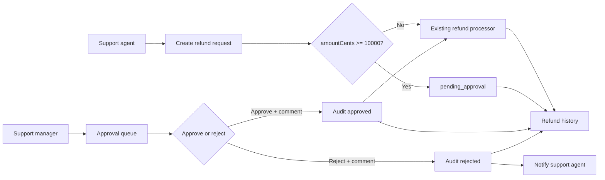

# Refund Approval Technical Design

## Source

- PRD: `docs/prd/refund-approval.md`
- Project: `D:\sun-skills\prd-to-tech-design-review-workspace\fixtures\refund-app`
- Generated: 2026-04-24
- Collaboration mode: Inline frontend/backend reviewer simulation using the skill workflow; no separate subagent runtime was available.

## Executive Summary

Add manager approval for refunds at or above 100 USD by extending the existing refund domain instead of replacing the current processor. Low-value refunds continue to enter processing immediately. High-value refunds are created as `pending_approval`, shown in a manager approval queue, audited on approve/reject, and only approved refunds are handed to the existing refund processor.

The current fixture exposes a minimal `src/api/refunds.ts` API with `draft | processing | completed | failed` and a simple `RefundsPage`. The implementation must widen that API contract, status union, refund shape, and history screen so approval state is visible and high-value refunds cannot bypass approval.

## PRD Scope Mapping

| PRD Requirement | Technical Coverage | Notes |
| --- | --- | --- |
| Refunds under 100 USD can be processed immediately. | `createRefund` service branches by `amountCents < 10000` and returns `processing`; existing processor path remains available. | Boundary is inclusive at 100 USD for approval. |
| Refunds at or above 100 USD require manager approval. | Server-side guard creates `pending_approval`; processor rejects direct processing unless status is `approved` or below threshold. | Cannot rely on frontend checks alone. |
| Support agents can add reason and evidence. | Create request includes `reason` and optional `evidence`; evidence metadata is stored with the refund request. | Evidence storage details remain an implementation assumption. |
| Managers can approve or reject with comments. | Manager-only approve/reject endpoints require a non-empty comment and append audit entries. | PRD does not specify whether comments are visible to agents; assume visible in history. |
| Approved requests trigger the existing refund processor. | Approval transaction sets `approved`, writes audit, then enqueues/triggers processor to move to `processing`. | Processor trigger must be idempotent. |
| Rejected requests notify the support agent. | Reject flow records audit, sets `rejected`, and emits a notification event/job. | Notification channel is not specified. |
| Managers see pending approvals with amount, customer, order, reason, and evidence. | Add manager approval queue screen and list API with required fields. | Current `Refund` lacks customer/evidence fields. |
| Approval and rejection actions are audited. | Add `refund_approval_events` or embedded audit trail with actor, action, comment, timestamp, before/after status. | Finance operator can use same audit data. |
| Existing refund history shows approval status. | Extend `RefundsPage` history rows with approval status and latest approval comment/action metadata. | Avoid separate history model if existing list can be extended. |

## Architecture Overview



The backend owns lifecycle enforcement, threshold validation, authorization, audit creation, and processor dispatch. The frontend presents role-specific workflows and treats server responses as authoritative.

## Frontend Design

### Routes and Screens

- Extend the existing refunds history page (`src/pages/refunds.tsx`) to show approval status for every refund.
- Add a manager approval queue route, for example `/refunds/approvals`, restricted to support managers.
- Add a refund detail or expandable row showing amount, customer, order, reason, evidence, current status, and audit events.
- Add approve/reject actions from the pending approval queue, each requiring a manager comment before submission.

### Component Structure

- `RefundsPage`: history list/table, status filter, approval status display, empty/error states.
- `RefundApprovalQueue`: pending approvals list with amount, customer, order, reason preview, evidence indicator, and action buttons.
- `RefundApprovalDecisionDialog`: shared approve/reject dialog with comment textarea, evidence context, loading state, and validation errors.
- `RefundStatusBadge`: supports all lifecycle values from the PRD.
- `RefundEvidenceList`: renders evidence metadata/links when present.

### Client State and Data Fetching

- Fetch history with filters for `status` and optionally `approvalRequired`.
- Fetch manager queue with `status=pending_approval`.
- After approve/reject succeeds, invalidate both approval queue and refund history queries.
- Do not use optimistic status transitions for approve/reject because audit and processor dispatch are server-owned.
- Disable duplicate action submission while the decision request is in flight.

### UX States and Validation

- Create refund form: require `orderId`, positive `amountCents`, non-empty reason, and evidence when business policy later requires it.
- If `amountCents >= 10000`, show that the request will require manager approval after submit.
- Approval queue states: loading, empty, permission denied, action failed, and stale conflict if the request was already decided.
- Manager comment is required for approve and reject actions.
- Rejected refund rows should show rejection status and latest manager comment.

### Accessibility and Responsive Behavior

- Tables must retain accessible column headers for amount, customer, order, status, reason, and actions.
- Dialog actions should be keyboard reachable, trap focus while open, and return focus to the originating action.
- On narrow screens, approval rows can collapse into stacked label/value groups while preserving visible status and primary actions.

## Backend Design

### Domain Model

Extend the refund status union from:

```ts
type RefundStatus = "draft" | "processing" | "completed" | "failed";
```

to:

```ts
type RefundStatus =
  | "draft"
  | "pending_approval"
  | "approved"
  | "rejected"
  | "processing"
  | "completed"
  | "failed";
```

Extend `Refund` with:

- `customerId` and display-safe `customerName` or `customerLabel` for manager queue.
- `evidence?: RefundEvidence[]`.
- `createdByAgentId`.
- `approvalRequired: boolean`.
- `approvalComment?: string`.
- `approvedByManagerId?: string`.
- `decidedAt?: string`.
- `auditEvents?: RefundAuditEvent[]`.

### Data Storage and Migrations

The fixture has no persistence layer, but an implementation should migrate the refund store with:

| Store | Fields | Indexes | Notes |
| --- | --- | --- | --- |
| `refunds` | `status`, `approval_required`, `reason`, `evidence`, `created_by_agent_id`, `approved_by_manager_id`, `approval_comment`, `decided_at` | `(status, created_at)`, `(order_id)`, `(created_by_agent_id)` | Supports history and manager queue. |
| `refund_approval_events` | `refund_id`, `actor_id`, `action`, `comment`, `from_status`, `to_status`, `created_at` | `(refund_id, created_at)`, `(actor_id, created_at)` | Durable audit for approval/rejection. |

If the real project uses embedded documents instead of relational tables, preserve the same fields and index by `status` and `created_at`.

### Services and Business Rules

- `createRefund(input, actor)`:
  - Validate actor has support-agent permission.
  - Validate `amountCents > 0`, `orderId`, and `reason`.
  - If `amountCents >= 10000`, create `pending_approval` and do not call the processor.
  - If `amountCents < 10000`, create `processing` and call the existing processor as today.
- `approveRefund(refundId, comment, actor)`:
  - Require support-manager permission.
  - Require current status `pending_approval`.
  - In one transaction, create audit event and set status to `approved`.
  - Trigger existing processor idempotently; processor may then set `processing`.
- `rejectRefund(refundId, comment, actor)`:
  - Require support-manager permission.
  - Require current status `pending_approval`.
  - In one transaction, create audit event and set status to `rejected`.
  - Emit notification to the creating support agent.
- Processor guard:
  - Do not process high-value refunds unless status is `approved` or already `processing` from an approved transition.

### Background Jobs and Integrations

- Existing refund processor remains the issuing integration.
- Approval should enqueue or call the processor through an idempotent interface keyed by `refundId`.
- Rejection emits a notification event/job for the support agent.
- Evidence should be stored as metadata plus safe links; scanning/storage is outside the PRD and remains an assumption.

### Security, Permissions, and Audit

- Support agents can create refunds and view their own/history-permitted refund records.
- Support managers can list pending approvals and decide them.
- Finance operators can view approved/completed refund audit data.
- Approve/reject endpoints must reject non-manager actors.
- Audit events are append-only and include actor, action, comment, timestamp, and status transition.
- Comments and evidence may contain sensitive data; sanitize display text and avoid leaking evidence links to unauthorized roles.

## API Contract

| Method | Path | Purpose | Request | Response | Errors |
| --- | --- | --- | --- | --- | --- |
| `POST` | `/api/refunds` | Create refund request. | `{ orderId, amountCents, reason, evidence? }` | `Refund` with `processing` for low-value or `pending_approval` for high-value. | `400` invalid amount/reason/evidence, `403` not support agent. |
| `GET` | `/api/refunds` | List refund history. | Query: `status?`, `orderId?`, `approvalRequired?` | `{ refunds: Refund[] }` | `403` not authorized. |
| `GET` | `/api/refunds/approvals` | Manager pending approval queue. | Query: pagination/filter params. | `{ refunds: Refund[], nextCursor? }` | `403` not support manager. |
| `POST` | `/api/refunds/:id/approve` | Approve pending high-value refund. | `{ comment }` | `Refund` with `approved` or `processing` depending processor handoff timing. | `400` missing comment, `403` not manager, `404` missing refund, `409` not pending. |
| `POST` | `/api/refunds/:id/reject` | Reject pending high-value refund. | `{ comment }` | `Refund` with `rejected`. | `400` missing comment, `403` not manager, `404` missing refund, `409` not pending. |
| `GET` | `/api/refunds/:id/audit` | View refund audit trail. | None. | `{ events: RefundAuditEvent[] }` | `403` unauthorized, `404` missing refund. |

Example create response for a high-value refund:

```json
{
  "id": "refund_123",
  "orderId": "order_456",
  "amountCents": 15000,
  "status": "pending_approval",
  "reason": "Damaged item",
  "approvalRequired": true,
  "evidence": [
    { "id": "ev_1", "type": "image", "label": "Photo evidence" }
  ]
}
```

## Data Model

| Entity/Table | Fields | Relationships | Notes |
| --- | --- | --- | --- |
| `Refund` | `id`, `orderId`, `customerId`, `amountCents`, `status`, `reason`, `evidence`, `createdByAgentId`, `approvalRequired`, `approvalComment`, `approvedByManagerId`, `decidedAt`, timestamps | Has many approval audit events. | Existing interface in `src/api/refunds.ts` must be expanded. |
| `RefundEvidence` | `id`, `refundId`, `type`, `label`, `url` or storage key, `createdAt` | Belongs to refund. | Links must be permission checked or time-limited. |
| `RefundAuditEvent` | `id`, `refundId`, `actorId`, `action`, `comment`, `fromStatus`, `toStatus`, `createdAt` | Belongs to refund and actor. | Required for approval/rejection actions. |
| `Notification` or event | `recipientAgentId`, `refundId`, `type`, `payload`, `createdAt` | Emitted from rejection. | Existing notification system is not present in fixture. |

## State and Lifecycle Rules

Valid statuses:

- `draft`
- `pending_approval`
- `approved`
- `rejected`
- `processing`
- `completed`
- `failed`

Allowed transitions:

| From | To | Actor/System | Side Effects |
| --- | --- | --- | --- |
| `draft` or new request | `pending_approval` | Support agent via create service | High-value request saved; no processor call. |
| `draft` or new request | `processing` | Support agent via create service | Low-value refund enters existing processor. |
| `pending_approval` | `approved` | Support manager | Audit event created; processor triggered. |
| `approved` | `processing` | System | Existing refund processor starts issuing refund. |
| `pending_approval` | `rejected` | Support manager | Audit event created; support agent notified. |
| `processing` | `completed` | System | Existing processor success. |
| `processing` | `failed` | System | Existing processor failure. |

Invalid transitions return `409 Conflict`, including approving a rejected refund, rejecting an approved refund, or processing a high-value refund that has not been approved.

## Error Handling

- Validation errors return field-level messages for amount, reason, evidence, and comment.
- Permission failures return `403` and the frontend shows a permission-denied state instead of an empty queue.
- Stale approval actions return `409` with the latest refund status so the frontend can refresh the row.
- Processor dispatch failures after approval should leave an auditable state. Prefer `approved` plus retryable processor job failure over silently reverting approval.
- Evidence load failures should not block manager decision if the metadata is present, but the UI must show which evidence failed to load.

## Observability and Operations

- Log every create, approve, reject, processor dispatch, and rejected invalid transition with `refundId`, actor ID where available, previous status, and next status.
- Metrics:
  - Count of refunds created by threshold path.
  - Pending approval queue size and age.
  - Approval/rejection counts.
  - Processor dispatch failures after approval.
  - Unauthorized approval attempts.
- Alerts:
  - Pending approvals older than the product-defined SLA once that SLA exists.
  - Approved refunds stuck before `processing`.
- Admin repair tooling should support retrying processor dispatch for `approved` refunds without duplicating issued refunds.

## Testing Strategy

- Backend unit tests for threshold branching at `9999`, `10000`, and greater than `10000` cents.
- Backend authorization tests for support agent, support manager, and finance operator access.
- Backend transition tests for approve, reject, duplicate decision, and direct high-value processor bypass.
- Audit tests confirming approve/reject create immutable events with comments.
- Notification test confirming rejection emits support-agent notification event.
- Frontend tests for history status rendering, pending approval queue, required comment validation, permission denied state, and stale `409` refresh handling.
- Integration/e2e tests for:
  - Low-value refund proceeds to processing.
  - High-value refund appears in manager queue and then processes after approval.
  - High-value refund rejection appears in history and notifies the agent.

## Collaboration Record

### Frontend Reviewer Summary

- The existing `RefundsPage` is only a placeholder; it needs history rows, status badges, and approval metadata.
- Managers need a separate pending approval queue or a filtered manager view.
- FE needs backend to return all PRD fields in queue rows: amount, customer, order, reason, evidence, and current status.
- Approve/reject should use a blocking dialog with required comments and no optimistic lifecycle changes.
- The current status type is incompatible with the PRD and must be expanded before UI work can be type-safe.

### Backend Reviewer Summary

- The current `createRefund` always returns `processing`, which would violate the high-value approval requirement.
- Approval enforcement must live server-side with processor-level bypass protection.
- Audit should be modeled explicitly rather than inferred from status changes.
- Approve/reject need manager authorization, idempotent processor handoff, and `409` conflict handling.
- The fixture has no database or auth layer, so the design names required contracts and storage fields for the later implementation.

### Exchange Notes

- Frontend request: return `409` conflicts with the latest refund status so stale manager screens can update gracefully.
- Backend response: accepted; lifecycle endpoints should return the current refund on conflict where authorization allows.
- Backend constraint: approval status changes are not optimistic because audit and processor dispatch must be authoritative.
- Frontend response: accepted; UI will use loading/disabled states and refresh queries after mutation success.
- Shared decision: `approved` is retained as an auditable status even if the processor quickly moves the refund to `processing`.

### Resolved Decisions

- Use `amountCents >= 10000` as the high-value threshold.
- Keep low-value refunds on the existing immediate processor path.
- Add manager-only approve/reject endpoints rather than overloading `createRefund`.
- Store approval/rejection audit entries as first-class data.
- Show approval state in existing refund history as well as in the manager queue.

### Remaining Open Questions

- What notification channel should rejected requests use?
- Are manager comments visible to support agents, finance operators, or both?
- What evidence file types, sizes, and retention rules are required?
- Is there an approval SLA for aging pending requests?
- Can finance operators see all audit events or only approved/completed refund records?

### Assumptions

- Currency threshold is exactly USD 100.00 represented as `10000` cents.
- Existing role information is available to API handlers even though the fixture does not show auth code.
- Evidence can be represented initially as metadata and secure links.
- The existing refund processor can be invoked idempotently by `refundId`.
- This design is for an old project increment; existing low-value behavior should remain backward compatible.

## Risks and Follow-Ups

- The largest compatibility risk is code that assumes `RefundStatus` has only four values. Update status rendering, filters, tests, and processor logic together.
- Processor idempotency is critical; duplicate approve requests or retrying approved refunds must not issue duplicate money movement.
- Audit data should be immutable enough for finance review; do not rely only on mutable refund columns.
- Product decisions around evidence and notification channel should be resolved before implementation tasks are finalized, but they do not block this technical design.
